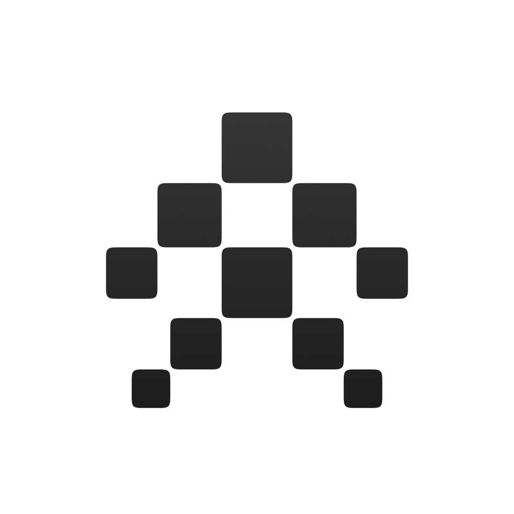

<div align="center">
  
  <h1>NotchAgent</h1>
  <p>Live Claude Code status indicator inside your MacBook's notch.</p>

  
  
  
</div>

---

<video src="https://github.com/user-attachments/assets/359a03e8-ba55-4dbc-af5b-9f76d82b5916" autoplay loop muted playsinline></video>

---

While Claude is thinking, running tools, or waiting for input, a pixel grid animates inside your notch — so you always know what's happening without switching to the terminal.

- Three states: **idle**, **working**, **awaiting input** — each with distinct animation and color
- Live count of running `claude` processes on the right side of the notch
- Optional sound alerts when Claude finishes or needs your attention
- Zero screen real estate used — lives entirely inside the hardware notch

---

## Install

**Requirements:** macOS 13+, Xcode Command Line Tools

```bash
xcode-select --install  # skip if already installed
```

```bash
/bin/bash -c "$(curl -fsSL https://raw.githubusercontent.com/TeamNoSleepz/notch-agent/main/install.sh)"
```

Open `/Applications/NotchAgent.app`, then click the menu bar icon → enable **Launch at Login**.

### What the installer does

1. Clones the repo to `~/.notch-agent`
2. Builds a release binary, wraps it into `NotchAgent.app`, installs to `/Applications`
3. Injects Claude Code hooks into `~/.claude/settings.json` — 8 events pointing at `~/.notch-agent/hooks/notch-agent-hook.py`

Running the installer again updates to the latest version.

---

## States

| State | Animation | Color |
|---|---|---|
| **Idle** | Slow animated trail | Grey |
| **Working** | Animated trail with glow | Cream + orange glow |
| **Awaiting input** | Trail cycling down center column | Red |

---

## Settings

Click the menu bar icon → **Settings**:

- **Color palette** — Default (cream/red/grey)
- **Sounds** — chime when Claude interrupts you or finishes a task

---

## Uninstall

```bash
~/.notch-agent/uninstall.sh
```

Removes hooks from `~/.claude/settings.json`, deletes `/Applications/NotchAgent.app`, removes `~/.notch-agent`, and cleans up `/tmp/notch-agent*`.

> [!WARNING]
> If you installed manually (git clone), run `uninstall.sh` before deleting the repo. Dead hook paths in `~/.claude/settings.json` cause errors on every Claude session. Fix by removing `notch-agent-hook` entries manually from that file.

---

## FAQ

**Does this work on Macs without a notch?**
No — the notch panel requires the physical notch cutout. MacBooks from 2021 and later have it.

**Does it work on external displays?**
The notch panel only appears on the built-in display. The menu bar icon and process count work on any display.

**Why does install require Xcode Command Line Tools?**
NotchAgent is built from source using Swift. Xcode Command Line Tools provides the Swift compiler — it's a ~500MB download but you likely already have it.

**Does it affect performance?**
No. The app is a lightweight SwiftUI panel with no background polling — it only reacts to hook events fired by Claude Code.

**The hook events stopped firing after sleep. What do I do?**
Restart NotchAgent from the menu bar icon. A known limitation of the Unix socket after system sleep on some macOS versions.

---

## How it works

```
Claude Code
    │  hook fires on every event (PreToolUse, Stop, etc.)
    ▼
hooks/notch-agent-hook.py
    │  sends JSON payload to /tmp/notch-agent.sock
    │  fire-and-forget, exits immediately
    ▼
NotchAgent.app
    │  Unix socket server reads event → maps to state
    ▼
Notch panel + menu bar icon
```

**Hook events → states:**

| Event | State |
|---|---|
| `PreToolUse`, `UserPromptSubmit`, `PostToolUse`, `PostToolUseFailure`, `SubagentStart`, `SubagentStop`, `PreCompact`, `PostCompact` | Working |
| `Stop`, `StopFailure`, `SessionStart`, `PermissionRequest`, `Notification` (idle) | Awaiting input |
| `SessionEnd`, `Notification` (other) | Idle |

**Notch panel** — an `NSPanel` at `mainMenu + 3` window level, sized to the physical notch using `auxiliaryTopLeftArea` / `auxiliaryTopRightArea`. Mouse events pass through.

**Indicator** — 3×3 grid of 5×5pt cells. Five animation patterns (snake, single horizontal, single vertical, staggering horizontal, staggering vertical) picked randomly each time Claude starts working.

---

## Development

```bash
swift build && .build/debug/NotchAgent
```

Auto-rebuild on file changes:

```bash
./dev.sh
```

Build the `.app` bundle only (no install):

```bash
./scripts/bundle.sh
```

---

## Project structure

```
notch-agent/
├── Sources/NotchAgent/
│   ├── main.swift                      # NSPanel, NSStatusItem, IndicatorView, AppDelegate
│   ├── StateWatcher.swift              # ClaudeState — Unix socket server + agent counter
│   ├── SettingsWindowController.swift  # Settings UI, AppPreferences, color palettes
│   └── Resources/                      # App icon, status bar icon
├── hooks/
│   ├── notch-agent-hook.py             # Claude Code hook — sends events via Unix socket
│   ├── notch-agent-hook.sh             # Shell wrapper for the hook
│   └── watch.sh                        # File watcher for dev rebuilds
├── scripts/
│   ├── bundle.sh                       # Creates NotchAgent.app bundle
│   └── install.sh                      # bundle.sh + copy to /Applications
├── install.sh                          # curl one-liner entry point
├── setup.sh                            # Build, install app, wire hooks
├── uninstall.sh                        # Full cleanup
├── dev.sh                              # Auto-rebuild on file changes
└── Package.swift
```

---

## Contributing

Issues and PRs welcome. For large changes, open an issue first to discuss.

---

## License

MIT
